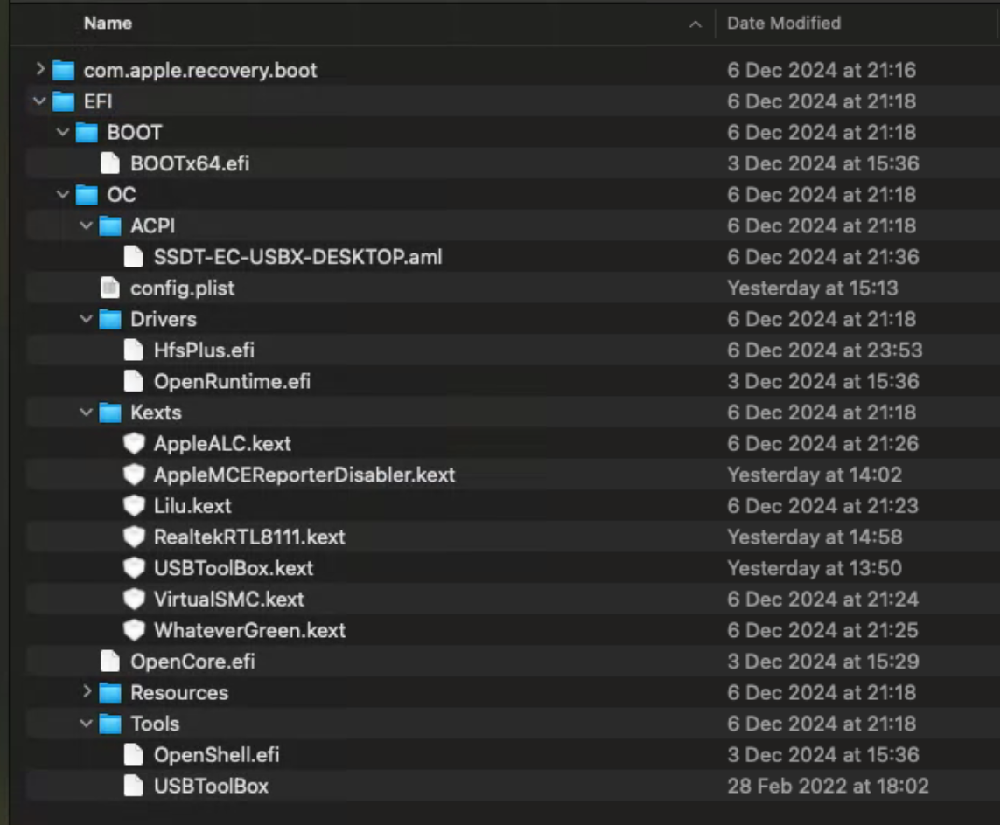
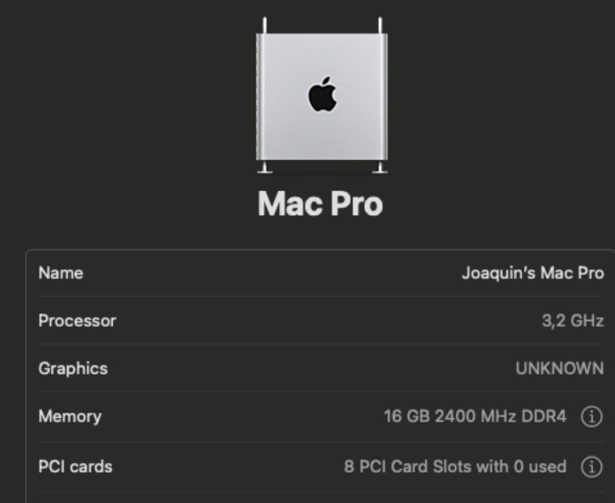

# WIP!
I'm still working on this repository.

## What you can expect 

This repository provides you an almost complete configured EFI to install and run MacOS Sequoia in a very specific set of hardware described here:

| Component   | Specification      |
|-------------|--------------------|
| CPU         | Ryzen 5 1600       |
| GPU         | RX 470 4GB         |
| Motherboard | Gigabyte A320M-S2H |
| RAM         | 16GB DDR4 2400mhz  |
| Ethernet    | Realtek RTL 8111   |

Look at this as a game savefile. In the best scenario it will save you some time and headaches.

You will need to download this repository content and follow some linked guides to be able to install it.

You will need to use some tools like ProperTree to edit some configurations and GenSMBIOS to generate serial numbers.

## What you can't expect
- This is not a replacement for Dortania's OpenCore Install Guide.
- Do not expect it to just download this and install OS X. You'll have to run some scripts and make some configurations.
- Do not expect it to work on other hardware nor other OS X versions
- I can't provide help installing or debugging this. If you're struggling to make this work I highly recommend you to join [AMD OS X discord](https://discord.gg/EfCYAJW) and seek for help there.

# Contents
This EFI was built following [Dortania's OpenCore Install Guide](https://dortania.github.io/OpenCore-Install-Guide/prerequisites.html#prerequisites).

**EFI**
- BOOTx64.efi (OpenCore 1.0.3 RELEASE)

**ACPI**
- SSDT-EC-USBX-DESKTOP.aml

**Drivers**
- HfsPlus.efi
- OpenRuntime.efi

**Kexts**
- AppleALC.kext v1.9.3 RELEASE
- AppleMCEReporterDisabled.kext v1.0 RELEASE
- Lilu.kext 1.7.0 RELEASE
- RealtekRTL8111.kext v2.2.2 RELEASE
- VirtualSMC.kext 1.3.4 RELEASE
- WhateverGreen.kext v1.6.9 RELEASE

**Tools**
- OpenShell.efi
- USBToolbox

You must read the following sections:
- [Basic terminology](https://dortania.github.io/OpenCore-Install-Guide/terminology.html)
- [USB Creation](https://dortania.github.io/OpenCore-Install-Guide/installer-guide/)
- [Configure platform info](https://dortania.github.io/OpenCore-Install-Guide/AMD/fx.html#platforminfo)

## Sequoia (15.1.1)

As you may notice, GPU is not recognized on this version.
If I find a fix I'll be updating this repository.

### How to use

